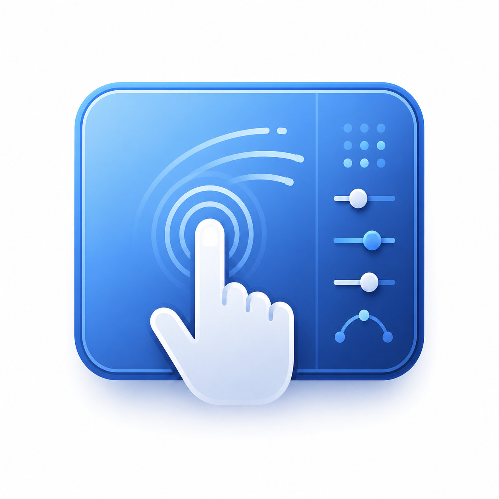

<p align="center">
  
</p>

<h1 align="center">KeyFlow</h1>

<p align="center">
  Keyboard shortcuts, trackpad gestures, and fluid window switching for macOS.
</p>

<p align="center">
  <a href="https://github.com/mayankhansraj12/KeyFlow/actions/workflows/ci.yml"></a>
  <a href="LICENSE"></a>
  
  
</p>

<p align="center">
  <a href="https://github.com/mayankhansraj12/KeyFlow/releases/latest/download/KeyFlow-0.1.7.dmg">
    
  </a>
</p>

<p align="center">
  <a href="docs/GETTING_STARTED.md">Getting started</a>
  ·
  <a href="docs/README.md">Documentation</a>
  ·
  <a href="CONTRIBUTING.md">Contribute</a>
</p>

KeyFlow is an open-source, native macOS utility for turning keyboard and
trackpad input into faster everyday workflows. It is local-first, designed to
fail safely, and built with SwiftUI, AppKit, Quartz, Accessibility, Core Audio,
and ScreenCaptureKit.

> [!IMPORTANT]
> KeyFlow `0.1.7` is the current release. Raw multi-finger gestures use an
> isolated compatibility layer built on an undocumented macOS framework and
> remain experimental.

## Highlights

- **App-launch shortcuts** — record a global keyboard chord and choose the app
  it opens.
- **Continuous volume gestures** — use four- or five-finger vertical movement
  with configurable response time, speed, and step size.
- **Media and screenshot gestures** — assign multi-finger taps or clicks to
  mute, Play/Pause, full-screen capture, or interactive capture.
- **Interactive window switcher** — navigate open windows in two dimensions
  with a persistent four-finger gesture.
- **Custom overlays** — personalize the Sound Bar and window-switcher
  appearance without mixing their settings.
- **Local-first operation** — no account, analytics, advertising, or telemetry.
- **Safety by design** — input interception fails open, synthesized events are
  tagged, and all mappings can be paused from the menu bar.

See the complete [feature guide](docs/FEATURES.md) and
[implementation status](docs/IMPLEMENTATION_STATUS.md).

## Install

Download [the latest KeyFlow release for macOS](https://github.com/mayankhansraj12/KeyFlow/releases/latest/download/KeyFlow-0.1.7.dmg),
open the DMG, and drag KeyFlow into Applications.

This free release is not Apple-notarized. macOS may require you to
Control-click KeyFlow and choose **Open**, or approve it under
**System Settings → Privacy & Security**.

The first launch explains the permissions needed for enabled features. See
[Getting started](docs/GETTING_STARTED.md) for installation, permission, and
troubleshooting instructions.

## Build from source

Requirements:

- macOS 15 or later
- Xcode 26, or another compatible Swift 6.2+ toolchain

```sh
git clone https://github.com/mayankhansraj12/KeyFlow.git
cd KeyFlow
./Scripts/validate.sh
./Scripts/build-app.sh
open dist/KeyFlow.app
```

Build the universal drag-to-Applications DMG:

```sh
./Scripts/build-local-dmg.sh
open release/KeyFlow-0.1.7.dmg
```

The first DMG build downloads two small, hash-pinned open-source build packages
into the ignored `.build` directory. The output is locally signed, universal
for Apple silicon and Intel, and verified before the script completes.

More detail is available in [Building and releasing](docs/BUILDING.md).

## Permissions

| Permission | Why KeyFlow uses it |
|---|---|
| Accessibility | Suppress configured shortcuts, synthesize keyboard events, and raise selected windows |
| Input Monitoring | Observe enabled global keyboard and trackpad input |
| Screen Recording | Optional; render live previews in the window switcher |

KeyFlow processes input and window previews on your Mac. It does not transmit
them. Read the full [privacy policy](docs/PRIVACY.md).

## Project structure

```text
Sources/
├── KeyFlowApp/                  macOS app, UI, platform adapters, services
├── KeyFlowCore/                 domain, persistence, validation, matching
├── KeyFlowMultitouchBridge/     isolated raw-trackpad compatibility boundary
└── KeyFlowWindowServerBridge/   isolated exact-window focus boundary
```

Read [Architecture](docs/ARCHITECTURE.md) for runtime and dependency rules.

## Community

- Read [Contributing](CONTRIBUTING.md) before opening a pull request.
- Use [GitHub Issues](https://github.com/mayankhansraj12/KeyFlow/issues) for
  reproducible bugs and focused feature proposals.
- Follow the [Code of Conduct](CODE_OF_CONDUCT.md).
- Report vulnerabilities privately according to [Security](SECURITY.md).

## License

KeyFlow is available under the [MIT License](LICENSE). Third-party notices are
recorded in [Resources/ThirdPartyNotices.txt](Resources/ThirdPartyNotices.txt).
