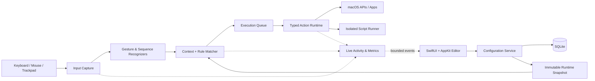

# KeyFlow — Product and Engineering Plan

Status: `0.1.7` local production foundation implemented; Developer ID, notarization, clean-install, and physical compatibility gates remain pending, 2026-07-16
Working name: **KeyFlow** (replace after trademark/domain review)  
Target: **macOS 15 and later**, Apple silicon first, Intel validated if commercial requirements justify it  
Distribution: signed and notarized direct download, not the Mac App Store

## 1. Product intent

KeyFlow is a local-first macOS shortcut and input customization app. A user maps a trigger—keyboard, mouse, trackpad, app state, timer, screen edge, or another event—to one or more actions. Mappings can be global or context-specific, can contain conditions and control flow, and can be debugged without guesswork.

The goal is not a pixel-for-pixel BetterTouchTool clone. The goal is a reliable daily-driver automation platform with equivalent core workflows, a safer action model, a clearer editor, and an architecture that can expand to specialist devices later.

### Product principles

1. **Input must remain predictable.** A shortcut must never become stuck, repeat forever, or make the Mac unusable.
2. **Fast path stays tiny.** Event capture and gesture recognition do no disk, network, scripting, UI, or database work.
3. **Context is visible.** The editor explains why a mapping is active, shadowed, conflicting, or unavailable.
4. **Power is consented.** Permissions and risky actions are requested only when a feature needs them.
5. **Local first.** Configuration, clipboard history, scripts, and usage data remain on the Mac by default.
6. **Configuration is portable.** Versioned JSON import/export is documented and forward-migratable.
7. **Failure is reversible.** Safe mode, an emergency disable shortcut, automatic backups, and rollback are built in before beta.

## 2. Important platform decision

### What public macOS APIs can cover

- Global keyboard and mouse observation/filtering through Quartz event taps.
- Synthetic keyboard, mouse, and scroll events through `CGEvent`.
- App/window inspection and manipulation through the Accessibility API.
- System-provided gesture events such as swipe, magnify, rotate, pressure, and scroll where AppKit exposes them.
- Login launch through `SMAppService`.
- AppleScript/JXA, Shortcuts, shell commands, URLs, notifications, pasteboard, and app launching.

### Raw trackpad constraint

AppKit exposes touches and gestures primarily in an application's event/responder context. It does not provide a stable public interface for arbitrary system-wide raw finger contacts on built-in trackpads and Magic Trackpads. Features such as global three-finger taps, finger zones, TipTap, and custom contact geometry therefore require a compatibility implementation that may rely on undocumented behavior.

This must be treated as an explicit product risk, not hidden in the implementation:

- Put all raw contact access behind `TouchInputProvider`.
- Ship a public-API provider and separately isolate the compatibility provider.
- Dynamically capability-check by macOS build and device, never assume support.
- Sign the provider as part of the app; do not load arbitrary third-party binary plug-ins.
- Add a remote kill switch based on a signed, cached compatibility manifest, with a local opt-out.
- Never require SIP to be disabled and never install a kernel extension.
- Run Phase 0 hardware and notarization tests before promising advanced trackpad gestures.
- If the compatibility route fails the release gate, ship keyboard/mouse/system gestures first and label advanced raw-touch support as experimental—not “fully supported.”

## 3. Target users and primary journeys

### Target users

- Power users replacing repetitive keyboard and window-management work.
- Developers and creators who want app-specific mappings and macros.
- Accessibility-oriented users who need alternative inputs, without claiming medical-device status.
- Automation enthusiasts who need scripts and conditional workflows.

### Essential journeys

1. **First useful shortcut in under three minutes**
   - Install, understand permissions, record a key chord, choose an action, test, save.
2. **App-specific customization**
   - Create a mapping active only in a chosen app, window title, display, or input device.
3. **Trackpad customization**
   - Select a device, see live contacts, choose a gesture, tune sensitivity, test without saving, bind actions.
4. **Multi-step workflow**
   - Combine launch/focus, keystroke, delay, condition, script, and notification nodes.
5. **Troubleshoot a conflict**
   - Open Live Activity, press the trigger, and see capture → match candidates → selected rule → actions → result and timing.
6. **Recover safely**
   - Hold the emergency chord at launch or from anywhere to pause all interception, then disable the bad mapping.
7. **Move configuration**
   - Export selected profiles without secrets, inspect the manifest, and import with a capability/risk preview.

## 4. Scope and release tiers

“All features” is divided into release tiers so the first version is reliable instead of superficially broad.

### V1 — production daily driver

#### Keyboard triggers

- Standard chords; left/right modifier distinction; function and media keys.
- Key down, key up, tap, hold, long press, double tap, and repeat.
- Ordered key sequences with configurable timeout.
- Modifier-only sequences and a configurable Hyper Key.
- Key-to-key and chord-to-chord remapping.
- Simultaneous/chorded keys, pass-through, suppress, and replace modes.
- Device-aware matching where the hardware source can be determined reliably.
- Per-trigger repeat delay/rate and HUD feedback.
- Keyboard-layout-aware display plus physical-key matching mode.
- Conflict detection against KeyFlow rules and known macOS shortcuts.
- Synthetic-event tagging, recursion prevention, and maximum action depth.
- Secure-input detection where possible, with a clear paused/degraded status.

#### Trackpad and mouse triggers

- Built-in and external trackpad selection.
- Public gestures: scroll direction/velocity, swipe, pinch, rotate, and pressure/force where available.
- Advanced compatibility gestures after Phase 0: 1–5 finger tap/click/hold, directional swipes, TipTap, finger-count transitions, zones/edges/corners, force click, finger held while clicking, and drawing-mode activation.
- Normal mouse buttons 1–31, click counts, holds, chords, wheel/tilt, scroll direction and threshold.
- Mouse movement gestures and trainable drawings with confidence threshold and multiple samples.
- Required/forbidden modifiers and device-specific sensitivity.
- Live event/contact visualizer with privacy-safe diagnostics.
- Debounce, hysteresis, cancellation, palm rejection, and per-device calibration.

#### Context and trigger system

- Global mappings and app-specific mappings.
- Profiles that can be enabled, disabled, reordered, exported, and backed up.
- Conditional groups using frontmost app, bundle ID, window title/role, focused element role, display count/name, time range, device connection, keyboard modifiers, and user variables.
- Triggers for app launch/activate/deactivate/terminate, wake/unlock, timer, clipboard change, screen edge/corner, named trigger, menu-bar item, and URL scheme.
- Deterministic precedence: enabled profile order → context specificity → explicit priority → stable UUID tie-break.
- Conditions editor with AND/OR/NOT groups and an explanation of the current result.
- Per-rule cooldown, debounce, throttle, maximum concurrency, and cancellation policy.

#### Actions

- Send key chord/sequence/text, mouse click/move/drag, and scroll.
- Open URL/file/folder, launch/activate/hide/quit app, reveal in Finder.
- Window move/resize/center/maximize/halves/thirds/quarters, next display, restore previous frame, save/restore layout, and window switcher.
- Clipboard read/write, paste plain text, search history, favorites, and text transforms.
- Volume/media/display controls using supported APIs or configurable system shortcuts.
- Lock screen, sleep display, screenshot, Mission Control, desktop, notifications, and HUD.
- Run Apple Shortcut, AppleScript/JXA, and shell executable/script.
- HTTP request/webhook with secret fields stored in Keychain.
- Set/read variables and named triggers.
- Sequence, parallel group, delay, if/else, switch, repeat with hard limit, retry with backoff, stop, and error branch.
- Action timeouts, cancellation, structured result, redacted logs, and per-node test execution.

#### User experience and operations

- Menu-bar controller: enabled/paused, active profile/context, recent action, safe mode, open editor, quit.
- Configuration editor with profile/context sidebar, trigger list, action canvas/list, and inspector.
- Searchable trigger/action palette with keyboard navigation.
- Permission Center with current state, why it is needed, deep link to settings, and live re-check.
- Starter templates that are opt-in and editable.
- Undo/redo for editing, autosave, draft validation, duplicate, copy/paste, bulk enable/disable.
- Live Activity debugger and diagnostics export.
- Versioned imports, automatic backups, restore browser, and atomic migrations.
- Signed automatic updates with stable and beta channels.

### V1.5 — breadth after the engine is proven

- Floating/radial menus and richer HUD widgets.
- Clipboard file/image previews, pinning, retention rules, and transformations.
- Advanced window snapping zones and reusable multi-window layouts.
- MIDI triggers, Apple Remote/Siri Remote where supported, and microphone/audio-device state triggers.
- Stream Deck integration through an authenticated local bridge.
- Menu bar item customization and Notch Bar concepts that do not depend on private UI injection.
- Optional end-to-end encrypted profile sync.
- Local authenticated automation API, CLI, Shortcuts actions, and documented URL scheme.
- Community preset packages with signing, permissions manifest, and review warnings.

### Later / compatibility backlog

- Magic Mouse raw-touch gestures if Phase 0 proves maintainable.
- Legacy Touch Bar support for machines that still have one.
- iPhone/iPad remote companion, remote trackpad, and remote triggers.
- Additional vendor devices through separately maintained adapters.
- OCR/image-based triggers and opt-in AI actions.
- A declarative SDK for data-only trigger/action extensions; native third-party code stays out of process.

### Explicit non-goals for V1

- No kernel extension, root daemon, SIP bypass, keylogging history, or hidden recording.
- No arbitrary downloaded native plug-ins.
- No cloud account requirement or automatic clipboard upload.
- No promise to override Secure Input, the login window, FileVault unlock, or other protected macOS surfaces.
- No exact recreation of another product's name, visual identity, proprietary presets, or implementation.

## 5. User experience specification

### Main window

Use a native macOS three-column layout:

1. **Sidebar:** All Mappings, Profiles, Apps & Contexts, Devices, Named Workflows, Clipboard, and Settings.
2. **Content:** filterable mapping list showing trigger, context, action summary, status, last run, and conflicts.
3. **Inspector:** type-specific properties, conditions, behavior, and diagnostics.

An optional workflow canvas is appropriate for branching graphs; ordinary action sequences should remain a compact reorderable list. The canvas must never be required for simple mappings.

### Trigger capture

- Enter a clearly marked capture mode; Escape cancels.
- Show each event and modifier live.
- Let the user choose physical key or produced character semantics.
- For gestures, show the selected device surface and contacts.
- Detect conflicts before commit and offer replace, coexist with precedence, or cancel.
- Provide a temporary “try it” session that does not write configuration.

### Permission onboarding

Request no broad permissions on the welcome screen. Let the user choose the first feature, then guide only its dependencies:

- Accessibility: filtering input, synthetic input, window/UI automation.
- Input Monitoring: global observation when required by the selected capture path.
- Automation: requested by macOS per controlled target app.
- Screen Recording: only for optional screenshot/OCR/window-preview features.
- Files/folders: user-selected access represented by security-scoped bookmarks where applicable.
- Notifications: only when the user enables notification actions.

Every denied permission has a usable degraded mode and a concrete remediation message.

### Safety controls

- Default emergency chord: hold both Shift keys for five seconds; make it configurable but not removable without a replacement.
- Launch in safe mode while holding Shift.
- Auto-pause after repeated engine crashes.
- Detect a rule that suppresses its own escape keys and require confirmation.
- Disable imported scripts and network actions until the user reviews them.
- Show a persistent status indication while input capture/training is active.

## 6. System architecture



### Process model

#### `KeyFlow.app`

- Menu-bar resident app with optional Dock presence while its editor is open.
- Owns TCC permissions, event taps, input providers, matching, standard actions, HUD, and editor UI.
- Starts at login with `SMAppService.mainApp` so the user grants permissions to one stable signed executable.
- Uses a dedicated high-priority event run-loop thread; UI runs on the main actor; actions run in bounded task queues.
- A UI failure must not mutate the active immutable configuration snapshot. State changes are validated and atomically swapped.

#### `KeyFlowScriptRunner.xpc`

- Runs user-authored shell, AppleScript, and JXA tasks away from the input thread and UI process state.
- Exposes a small typed `NSXPCInterface`; validates connection identity and request limits.
- Runs without root privileges, accepts no arbitrary inbound network connection, uses a minimal environment, caps runtime/output, and supports cancellation.
- XPC provides crash and interface isolation, not a claim that arbitrary user scripts are securely sandboxed. The UI must label scripts as trusted local code.

#### Optional compatibility module

- A first-party, signed module behind the `TouchInputProvider` protocol.
- Contains all undocumented touch-device interaction and any Objective-C/C bridge needed for ABI containment.
- Has no database, network, scripts, or action execution access.
- Can be disabled independently by device/OS compatibility policy.

### Runtime layers

1. **Capture adapters** normalize platform events into `InputEvent` values with monotonic timestamp, device ID, source, phase, coordinates, pressure, key/button data, and flags.
2. **Recognizers** are deterministic state machines for chords, sequences, holds, taps, swipes, drawings, and finger transitions.
3. **Context service** publishes a throttled immutable `ContextSnapshot` containing frontmost app, focused window/element, screens, connected devices, variables, and permission state.
4. **Rule compiler** validates persisted mappings and builds indexed immutable match tables by trigger family and context.
5. **Matcher** evaluates candidates without database access and produces a `MatchDecision` including precedence and consumption behavior.
6. **Action runtime** executes a typed action graph with deadlines, cancellation, structured outputs, redaction, and concurrency limits.
7. **Observability pipeline** samples bounded diagnostic events into an in-memory ring buffer; persistence is opt-in and redacted.

### Fast-path rules

- No `await`, locks with unbounded wait, file I/O, database calls, network calls, logging strings, or UI dispatch inside the event-tap callback.
- Callback copies only required fields into a preallocated bounded queue and returns pass/suppress/replace promptly.
- Immutable snapshots are swapped atomically after full validation.
- If the queue is full or the engine becomes unhealthy, fail open and pass user input through.
- Handle `tapDisabledByTimeout`/`tapDisabledByUserInput`, re-enable safely, and record a health event.
- Every synthesized event carries a per-launch marker; marked events bypass trigger matching unless a rule explicitly permits one bounded re-entry.

## 7. Domain model and persistence

Use SQLite in WAL mode through GRDB, pinned through Swift Package Manager. Store stable relational fields as columns and type-specific trigger/action payloads as versioned Codable JSON. This balances queryability with an extensible action catalog. Keep the persistence layer behind protocols so it can be tested in memory.

### Core entities

- `Profile`: id, name, order, enabled, color/icon, timestamps.
- `ContextGroup`: id, profileID, name, predicate tree, priority, enabled.
- `Mapping`: id, profileID/contextID, name, enabled, priority, consume policy, cooldown, concurrency policy.
- `Trigger`: id, mappingID, kind, schemaVersion, payload, device selector.
- `ActionGraph`: id, mappingID/named workflow ID, schemaVersion.
- `ActionNode`: id, graphID, kind, payload, timeout, error policy, display position.
- `ActionEdge`: from, output port, to, order.
- `Variable`: namespace, name, typed value, persistence policy, updatedAt.
- `DeviceAlias`: stable best-effort fingerprint, friendly name, calibration; never assume hardware identifiers are permanent.
- `ClipboardItem`: metadata and encrypted/managed payload reference, with retention and exclusion policy.
- `RunRecord`: bounded/redacted execution summary; off or short retention by default.
- `SchemaMigration` and `BackupManifest`.

### Configuration transaction

1. UI edits a draft value, not the live object graph.
2. Domain validators check type constraints, permissions, cycles, unreachable nodes, and unsafe recursion.
3. Repository writes one SQLite transaction and updates the revision.
4. Rule compiler builds a complete runtime snapshot off the event thread.
5. Engine atomically swaps only a valid snapshot.
6. UI receives commit success or actionable validation errors.

### Import/export format

- ZIP package containing `manifest.json`, versioned `configuration.json`, and user-approved assets.
- UUIDs, minimum app version, required capabilities, checksums, and creator metadata in the manifest.
- No Keychain secrets, clipboard history, device serials, absolute private paths, or diagnostics.
- Imports are decoded with size/depth/count limits and shown in a diff/permission preview.
- Unknown future fields are preserved where safe; unsupported executable actions remain disabled.

## 8. Suggested repository structure

```text
tool/
├── KeyFlow.xcworkspace
├── Apps/
│   ├── KeyFlowApp/                 # app lifecycle, menu bar, editor composition
│   └── KeyFlowScriptRunner/        # XPC target
├── Packages/
│   ├── KeyFlowDomain/              # value types, validation, precedence
│   ├── KeyFlowPersistence/         # GRDB records, migrations, backups
│   ├── KeyFlowInputCore/           # normalized events, queues, recognizers
│   ├── KeyFlowInputMac/            # CGEvent/NSEvent/AX adapters
│   ├── KeyFlowTouchCompatibility/  # isolated optional touch provider
│   ├── KeyFlowContext/             # app/window/device context providers
│   ├── KeyFlowActions/             # typed action catalog/runtime
│   ├── KeyFlowAutomation/          # scripts, Shortcuts, Apple Events, HTTP
│   ├── KeyFlowUI/                  # design system and reusable editor views
│   ├── KeyFlowDiagnostics/         # redaction, signposts, health reports
│   └── KeyFlowTestSupport/         # clocks, event traces, fixtures, fakes
├── Tests/
│   ├── Integration/
│   ├── Performance/
│   ├── Migration/
│   └── UI/
├── Resources/
│   ├── Templates/
│   └── PrivacyInfo.xcprivacy
├── Config/                         # xcconfig by environment; no secrets
├── Scripts/                        # lint, build, package, sign, notarize
├── docs/
│   ├── adr/                        # architecture decision records
│   ├── threat-model.md
│   ├── configuration-format.md
│   └── release-runbook.md
└── .github/workflows/
```

### Technology choices

- Swift 6 with strict concurrency checks.
- SwiftUI for editor composition; AppKit for status items, advanced window behavior, event integration, and controls where SwiftUI is insufficient.
- Swift Package Manager with local feature packages; keep third-party dependencies few and pinned.
- GRDB/SQLite for durable data and explicit migrations.
- OSLog signposts and MetricKit where applicable; no input content in logs.
- XCTest/Swift Testing as supported by the chosen toolchain, plus deterministic event-trace fixtures.
- SwiftFormat and SwiftLint in CI with reviewed, repository-owned configuration.
- SwiftGen or equivalent only if asset/string scale justifies it.

## 9. Detailed subsystem design

### Keyboard engine

- Normalize scan code, logical character, flags, left/right modifiers, repeat, and hardware source.
- Compile direct chords into hash-indexed lookup tables.
- Model sequences as tries with monotonic deadlines; cancel cleanly on mismatch.
- Holds/double taps use an injected monotonic clock so tests do not sleep.
- Consumption decisions are made before dispatch; delayed ambiguity has a user-visible trade-off setting.
- Maintain key-down state and synthesize required key-up events when disabling a remap to prevent stuck modifiers.
- Tag generated events and cap recursive named workflows/action graphs.

### Gesture engine

- Normalize contacts into device-relative coordinates and explicit began/moved/ended/cancelled phases.
- Recognizers are independent state machines sharing read-only contact frames.
- Tune thresholds by physical gesture family, not one global sensitivity slider.
- Cancel on device disconnect, sleep, screen lock, provider reset, contact discontinuity, or confidence collapse.
- Drawing recognition starts with a resampled $1-style geometric recognizer; evaluate $P/$Q variants for multi-stroke support during the spike. Store several normalized training samples.
- Record opt-in anonymized geometry fixtures locally for regression reproduction; never store raw contacts by default.

### Context and precedence

- Watch `NSWorkspace` activation/lifecycle notifications.
- Use AX queries on a serial, timeout-bounded service; cache results and invalidate on notifications.
- Never block an input callback on AX.
- Compile predicates into short-circuiting evaluators with dependency metadata so only affected conditions re-evaluate.
- For equal candidates, use the documented deterministic precedence; Live Activity must show every rejected candidate and reason.

### Action runtime

- Each action implements metadata, Codable configuration, validation, required capabilities, redaction, and async execution.
- `ActionContext` provides only scoped services; action implementations never reach global singletons.
- Graph validation rejects unbounded cycles. Repeat nodes require an explicit finite maximum.
- Default execution is sequential. Parallel nodes declare join behavior: all, first success, or first completion.
- Support stop-on-error, continue, retry, and named error branch.
- Per-mapping concurrency modes: allow, drop while running, restart latest, or serialize with bounded queue.
- Destructive actions require confirmation at creation/import; permissions are separate from confirmation.

### Window management

- Use Accessibility window attributes with capability checks and typed error mapping.
- Account for visible frame, menu bar, Dock, Stage Manager, full screen, minimized windows, and multiple displays with different scale factors.
- Save layout using bundle ID, window role/title matcher, display identity, and normalized frame; restore best-effort with a preview.
- Never assume all apps expose writable position/size attributes.

### Clipboard manager

- V1 begins with text and standard metadata, explicit exclusions, retention count/time, favorites, and search.
- Detect sensitive/transient pasteboard types and known password-manager markers; default to exclusion.
- Encrypt persisted payloads with a Keychain-protected key, or let users disable persistence entirely.
- Blob storage is content-addressed, size-capped, and garbage-collected transactionally.
- Rich previews and image editing are V1.5 after storage/privacy behavior is proven.

## 10. Security and privacy plan

### Threat model priorities

- Malicious imported profile containing scripts, webhooks, or destructive actions.
- Secrets leaking through export, logs, crash reports, clipboard storage, or UI previews.
- XPC spoofing or over-broad interfaces.
- Infinite input recursion, event suppression, resource exhaustion, and action storms.
- Compromised update feed or downgrade.
- Fragile undocumented touch code causing crashes after an OS update.

### Controls

- Developer ID signing, Hardened Runtime, notarization, stapling, and signature verification in CI.
- No `get-task-allow` or disabled library validation in release unless a documented architecture review proves necessity.
- Sparkle 2 or an equivalent updater with EdDSA-signed feed/items, HTTPS, staged rollout, and rollback procedure.
- Keychain for tokens/secrets; redact them at the type level using `SecretReference`, never plain `String` in runtime logs.
- Imported executable/network actions disabled pending review; show hostnames, executable paths, and requested files.
- Script runner: no root, allowlisted environment variables, timeout, output cap, working-directory control, cancellation, and process-group termination.
- XPC interface accepts only NSSecureCoding/typed values with count and byte limits; validate peer code identity.
- Network server off by default. If added, bind loopback by default, require a per-client scoped token, rate-limit, and provide revocation/audit UI.
- Signed compatibility manifest cannot enable code or features absent from the installed binary; it can only disable known-bad provider combinations.
- Privacy policy and in-app data inventory before beta. Telemetry and crash uploads are explicit opt-in and contain no keys, typed text, clipboard data, window titles, script bodies, or URLs.

## 11. Quality strategy

### Test pyramid

- **Unit:** predicate evaluation, precedence, migrations, import validation, graph validation, redaction, keyboard state machines, all gesture recognizers, cancellation, and recursion guards.
- **Trace replay:** timestamped keyboard/mouse/touch fixtures replayed deterministically across recognizer versions.
- **Property/fuzz:** arbitrary event streams, corrupt imports, predicate trees, action graphs, and migration round trips.
- **Contract:** each input/context/action adapter tested against a fake protocol implementation and typed errors.
- **Integration:** event tap → matcher → synthetic action; AX against dedicated fixture apps; XPC crash/timeout; database recovery.
- **UI:** permission states, create/edit/test mapping, conflict resolution, import preview, backup restore, VoiceOver, keyboard-only navigation.
- **Hardware:** built-in Force Touch trackpads, Magic Trackpad generations in scope, Magic Mouse generations in scope, standard multi-button mice, multiple keyboard layouts, clamshell/external displays.
- **OS:** latest patch of every supported major macOS version plus current developer/beta seeds in a non-production compatibility lane.
- **Release:** clean-machine install, upgrade across every supported schema boundary, permission revoke/regrant, login launch, notarization/Gatekeeper, update/rollback, sleep/wake, fast user switching.

### Initial service-level targets

- Event callback p99 under 1 ms on supported baseline hardware.
- Local trigger-to-action-dispatch p95 under 20 ms for direct mappings.
- Idle CPU under 1% averaged over five minutes; no polling loops when notifications/events exist.
- Idle memory target under 150 MB with editor closed and clipboard manager disabled.
- Zero unbounded queues; fail open for input and shed diagnostics first.
- No lost/suppressed key-up events in 24-hour randomized stress tests.
- Crash-free sessions above 99.8% in beta before V1 promotion.
- Database survives forced termination at every migration/commit fault injection point.

Targets are measured and adjusted after Phase 0; they are release gates, not marketing claims.

## 12. Delivery plan

Estimates assume a stable team of four macOS engineers, one product designer, and shared QA/security/release support. With one engineer, expect roughly 18–24 months for a robust V1. With the assumed team, target 8–10 months for V1 and 12–18 months for the broader V1.5 set. Do not commit a public date before Phase 0.

### Phase 0 — feasibility and product proof (3 weeks)

Deliver:

- Minimal signed/notarized app that requests and re-checks relevant permissions.
- Event-tap prototype for capture, suppression, replacement, tagging, and timeout recovery.
- Trackpad provider experiments on every intended built-in/Magic Trackpad generation.
- AppKit global gesture coverage matrix versus raw compatibility coverage.
- Sleep/wake, disconnect/reconnect, multiple devices, and current macOS beta tests.
- Notarization/Hardened Runtime proof with the compatibility module included.
- 15-user concept test of editor, permission flow, and emergency disable.
- ADRs for distribution, process model, persistence, and trackpad support level.

Exit gate:

- Keyboard interception and recovery are reliable.
- At least the promised V1 gesture set is demonstrably detectable with acceptable false-positive rate.
- No SIP bypass, root, kernel extension, or unacceptable signing exception is required.
- Product scope is relabeled if raw touch cannot meet the gate.

### Phase 1 — engineering foundation (4 weeks)

Deliver:

- Workspace, local packages, CI, lint/format, dependency policy, build configurations.
- Domain types, SQLite schema/migrations, repository, atomic runtime snapshots.
- Permission Center shell, menu-bar lifecycle, login launch, safe mode.
- Diagnostics/redaction primitives, feature flags, backup skeleton.
- Event trace format and performance harness.
- Threat model and release signing/notarization dry run.

Exit gate: clean clone builds/tests; schema can migrate/rollback test fixtures; safe mode always bypasses interception.

### Phase 2 — keyboard-first alpha (6 weeks)

Deliver:

- Chords, sequences, modifier-only/Hyper Key, tap/hold/double-tap/repeat, remapping.
- App-specific and global contexts, deterministic precedence, conflicts.
- Core actions: keystroke/text, app/URL/file, named trigger, delay, notification/HUD.
- Main mapping editor, recorder, action palette, inspector, Live Activity.
- Synthetic event recursion guard and stuck-key recovery.
- Internal dogfood build and keyboard-layout matrix.

Exit gate: team uses it daily for two weeks with no input lockout; stress and latency targets pass.

### Phase 3 — mouse and trackpad beta (7 weeks)

Deliver:

- Mouse buttons/scroll/movement/drawings and device configuration.
- Public trackpad gestures plus the Phase 0-approved advanced provider.
- Gesture state machines, calibration, visualizer, training/test mode.
- Device disconnect, cancellation, provider health, compatibility kill switch.
- Hardware lab regression suite and OS beta lane.

Exit gate: defined gesture precision/recall thresholds pass per supported device; no crash or stuck interception across sleep/wake and hot-plug endurance runs.

### Phase 4 — workflow and automation platform (6 weeks)

Deliver:

- Typed action runtime, graph validation, control flow, variables, cancellation/concurrency.
- XPC script runner, AppleScript/JXA, Shortcuts, shell, and HTTP actions.
- Expanded contexts, timed/lifecycle/clipboard/edge/named triggers.
- Import/export v1 with risk preview and secret omission.
- Full action-level test UI and structured errors.

Exit gate: threat-model review complete; fuzz/import limits pass; malicious or broken workflows cannot block input processing.

### Phase 5 — window, clipboard, and product completeness (6 weeks)

Deliver:

- Window actions, snap layouts, restore behavior, multi-display tests.
- Text-first clipboard history, search, favorites, retention, exclusions, encryption.
- Templates, onboarding refinements, backups/restore browser, settings.
- Accessibility/VoiceOver, keyboard navigation, localization infrastructure.
- Public documentation and in-app help for every V1 trigger/action.

Exit gate: feature-complete beta; no P0/P1 accessibility, data-loss, permission, or recovery defects.

### Phase 6 — hardening and V1 launch (6 weeks minimum)

Deliver:

- Closed beta → public beta → release candidate with staged cohorts.
- Performance/energy optimization and 7-day endurance runs.
- Upgrade testing from every beta schema; updater rollback rehearsal.
- External security review focused on import, scripts, XPC, secrets, and updater.
- Privacy policy, support diagnostics flow, compatibility page, release runbook.
- Signed/notarized/stapled production artifact, update feed, website download checksums.

Exit gate: service targets pass, crash-free target passes, all release-blocking bugs closed, rollback and compatibility-disable procedures rehearsed.

### Phase 7 — V1.5 increments

Ship floating menus, richer clipboard, MIDI/device bridges, automation API/CLI, sync, and community packages as independently gated increments. Each new input provider or executable integration receives its own threat model and compatibility matrix.

## 13. Work breakdown and ownership

Recommended persistent streams:

- **Input platform:** capture, recognizers, compatibility provider, performance, hardware lab.
- **Automation platform:** rule compiler, contexts, actions, XPC runner, import/export.
- **Product app:** editor, recorder, visualizer, menu bar, onboarding, accessibility.
- **Reliability/data:** persistence, migrations, updater/release, diagnostics, backups, test infrastructure.
- Designer works one phase ahead; QA builds trace/hardware matrices from Phase 0 rather than joining only at the end.

Require an ADR for any choice that adds a privileged component, private API, runtime entitlement exception, persistent network listener, native plug-in loading, or cloud storage.

## 14. Release and operational practice

- Trunk-based development with short branches, required reviews, and protected release tags.
- CI on pull requests: build, unit/trace tests, static analysis, dependency license/security scan, migration tests.
- Nightly: integration/UI tests, fuzz corpus, performance trend, clean install, sleep/wake where hardware runners allow.
- Release: reproducible archive inputs, Developer ID signing, `notarytool`, staple, `codesign --verify`, Gatekeeper assessment, Sparkle signature/feed verification, malware scan, update-from-previous test.
- Phased rollout: team → 5% beta → 25% → 100%, with signed compatibility disables independent of app rollout.
- Keep the previous compatible release/update feed available for rollback.
- Support bundle includes app/OS/device versions, permissions state, schema version, health events, and redacted run results; it excludes input content by construction.

## 15. Risk register

| Risk | Likelihood / impact | Mitigation and decision gate |
|---|---|---|
| Raw multitouch breaks on macOS update | High / Critical | Provider isolation, Phase 0 proof, beta OS CI, signed kill switch, conservative support matrix |
| App becomes unusable due to swallowed input | Medium / Critical | Fail-open queues, emergency chord, safe mode, stuck-key recovery, stress gates |
| Accessibility/Input Monitoring permission confusion | High / High | Just-in-time Permission Center, live checks, one TCC-owning executable, degraded modes |
| Script/import enables malicious behavior | Medium / Critical | Disabled-on-import risky actions, review manifest, XPC isolation, limits, no root, secret redaction |
| Action catalog becomes unmaintainable | High / High | Typed action protocol, capability metadata, generated catalog tests, ownership boundaries |
| AX window behavior differs by app | High / Medium | Capability checks, best-effort results, fixture apps, compatibility docs, no false success |
| Event latency/energy regression | Medium / High | Tiny callback, immutable indexed snapshots, signposts, performance CI and budgets |
| Database migration/data loss | Low / Critical | Transactional migrations, backups, fault injection, forward-only production migrations with restore |
| Feature breadth delays useful release | High / High | Keyboard alpha first, tiered scope, explicit exits, independently shipped V1.5 increments |
| App Store expectations conflict with capabilities | Medium / Medium | State direct-download requirement early; Developer ID, Hardened Runtime, notarization |

## 16. Product analytics without surveillance

Default to no analytics. If the user opts in, collect only coarse counters needed for product health:

- App/OS version, hardware class, provider kind and health state.
- Trigger/action **type** counts, never key codes, text, window titles, paths, scripts, URLs, or clipboard contents.
- Aggregate latency buckets, failure categories, crash signatures, and permission funnel states.
- Random install identifier with reset/delete control and short server retention.

Document each event in a checked-in telemetry schema and add tests that reject unapproved fields.

## 17. Definition of done

A feature is done only when it has:

- Domain model and validation, permission/capability behavior, and typed errors.
- Unit tests and deterministic trace/integration coverage appropriate to the feature.
- Accessibility labels, keyboard navigation, localization-ready strings, and help copy.
- Redaction classification and threat-model update if it touches inputs, scripts, files, secrets, clipboard, network, or private APIs.
- Performance measurement on the input/action path.
- Migration/import behavior and backup/restore behavior where data changes.
- Live Activity visibility and a support diagnostic that explains failure without exposing content.
- Documentation and a tested disable/rollback route.

## 18. Decisions required after Phase 0

These decisions should not block the spike, but must be recorded before Phase 1 ends:

1. Confirm supported macOS/CPU/device matrix from target users and measured cost.
2. Decide whether advanced raw-touch support meets production quality or ships as experimental.
3. Confirm business model and licensing; it affects updates, account/sync, and preset distribution.
4. Choose whether clipboard persistence is opt-in or enabled with conservative defaults.
5. Select updater implementation and telemetry/crash vendor, including privacy/data-processing review.
6. Approve working name only after trademark, bundle ID, domain, and signing identity checks.

## 19. First implementation backlog

The first 15 build tickets, in dependency order:

1. Create workspace, targets, local packages, xcconfig, CI, lint/format.
2. Add signed Developer ID development/release pipeline and notarization smoke artifact.
3. Implement permission-state service and Permission Center prototype.
4. Implement `SMAppService` login lifecycle and safe-mode launch state.
5. Define `InputEvent`, `InputProvider`, injected clock, bounded queue, and trace codec.
6. Build event-tap adapter with pass/suppress, timeout recovery, and generated-event tagging.
7. Build keyboard chord recognizer and deterministic replay tests.
8. Spike public and compatibility `TouchInputProvider` implementations across hardware.
9. Define domain entities, schema v1, migrations, backup, and in-memory repository.
10. Implement rule validator/compiler and atomic runtime snapshot.
11. Implement frontmost-app context and precedence decision explanations.
12. Implement typed action protocol/runtime with keystroke, app launch, and HUD actions.
13. Build mapping list, keyboard recorder, action picker, and inspector vertical slice.
14. Add Live Activity ring buffer from capture through action result.
15. Run the complete vertical slice as a notarized dogfood build, then review Phase 0 exit evidence.

## 20. Reference basis

- Apple documents low-level event taps and synthetic Quartz events in [CGEvent](https://developer.apple.com/documentation/coregraphics/cgevent).
- Apple documents global, non-modifying AppKit event monitors in [NSEvent](https://developer.apple.com/documentation/appkit/nsevent).
- Apple's [Handling Trackpad Events](https://developer.apple.com/library/archive/documentation/Cocoa/Conceptual/EventOverview/HandlingTouchEvents/HandlingTouchEvents.html) describes responder-delivered gestures and touches.
- Permission trust can be checked through [AXIsProcessTrustedWithOptions](https://developer.apple.com/documentation/applicationservices/1459186-axisprocesstrustedwithoptions).
- Login registration uses [SMAppService](https://developer.apple.com/documentation/servicemanagement/smappservice) on current supported macOS versions.
- Direct distribution should follow Apple's [Hardened Runtime](https://developer.apple.com/documentation/security/hardened-runtime) and [notarization](https://developer.apple.com/documentation/security/notarizing-macos-software-before-distribution) requirements.
- Competitive scope was inventoried from BetterTouchTool's official [basic overview](https://docs.folivora.ai/docs/configuration/basic-overview/), [keyboard](https://docs.folivora.ai/docs/keyboard-shortcuts/overview/), [trackpad/mouse](https://docs.folivora.ai/docs/trackpad-mouse/magic-mouse-trackpad/), [action definitions](https://docs.folivora.ai/docs/actions/action-definitions/), and [scripting](https://docs.folivora.ai/docs/scripting/overview/) documentation.
